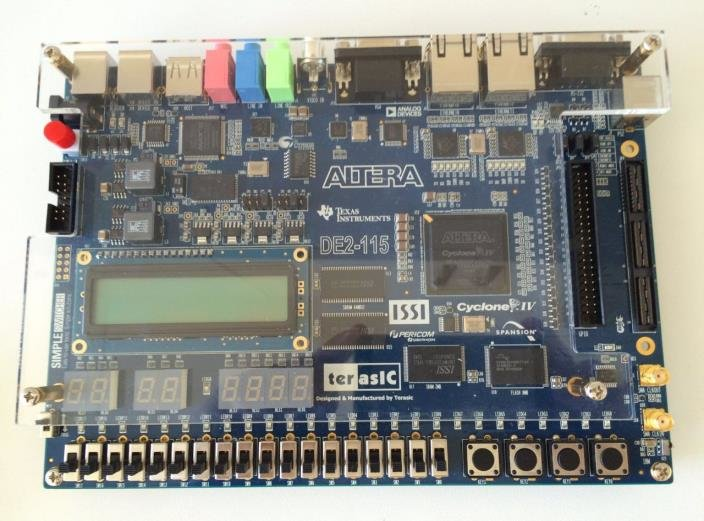

# FPGA-Based Digital System Design

This project implements a digital system on the DE2-115 FPGA board. The design is based on the custom ISA and includes both combinational and synchronous components. The system is fully verified in simulation and hardware using ModelSim, Quartus, and SignalTap.

## Project Structure

- **VHDL/** – RTL design files of the digital system.
- **TB/** – Testbench files for simulating the system.
- **SIM/** – ModelSim scripts and waveform configurations.
- **output_files/** – Compiled files including .sof for FPGA programming.
- **SDC/** – Synopsys Design Constraints files for timing analysis.
- **STP/** – SignalTap configuration files for on-board debugging.
- **DOC/** – Project documentation including the lab report and README.

## System Description

The system is composed of:
- A top-level design integrating both combinational and synchronous subparts
- A combinational datapath that implements ALU, logic, and shift operations
- A synchronous PWM module that supports dynamic control of both frequency and duty cycle

## Input/Output

- Inputs: 10 switches (SW), 4 pushbuttons (KEY)
- Outputs: 10 LEDs (LEDR), 6 seven-segment displays (HEX0–HEX5), PWM output (GPIO pin)
- Clock: 50 MHz on-board oscillator

## Features

- Fully combinational datapath (with wrapper registers for timing analysis)
- 16-bit custom ISA 
- PWM output module integrated under ALUFN control
- Quartus RTL viewer and resource usage per block
- Critical path and Fmax analysis
- Functional simulation in ModelSim
- On-board verification using SignalTap

## Tools Used

- Intel Quartus Prime Lite Edition 21.1 (Intel FPGA IDE)
- ModelSim 
- SignalTap Logic Analyzer
- DE2-115 FPGA board (Cyclone IV)

## References

- [FPGA based Digital Design.pdf](https://github.com/nyifvi1/FPGA-based-Digital-Design/blob/main/FPGA%20based%20Digital%20Design.pdf) – full assignment specification and ISA reference

### DE2-115 FPGA Development Board

*Figure: DE2-115 FPGA development board used in this project.*

